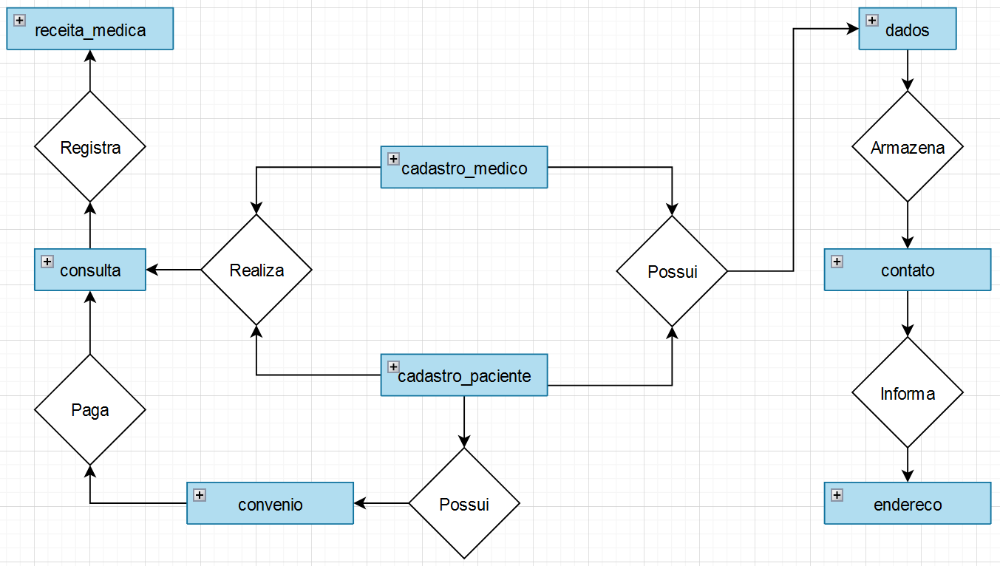
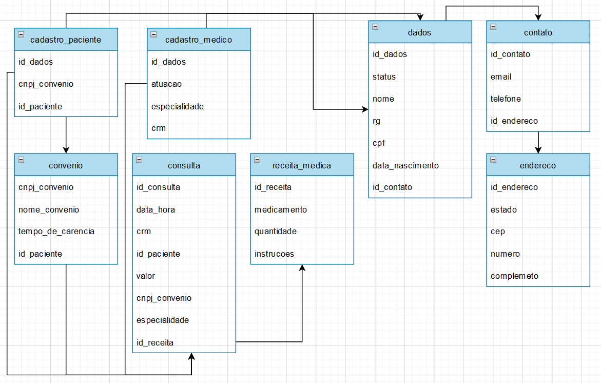
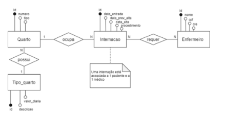
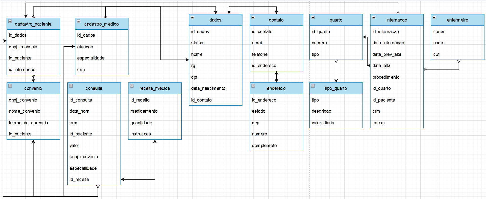

# O Hospital Fundamental
_Um pequeno hospital local busca desenvolver um novo sistema que atenda melhor às suas necessidades. Atualmente, parte da operação ainda se apoia em planilhas e arquivos antigos, mas espera-se que esses dados sejam transferidos para o novo sistema assim que ele estiver funcional._
##

## Descrição
Essa atividade foi proposta pelo professor Gabriel Augusto, no curso de desenvolvimento web fullstack em java, fornecido pelo Instituto Proa. A proposta da atividade é modelar, desenvolver e manipular uma base de dados para um hospital fictíceo, com objetivo de desenvolver conhecimentos em modelagem conceitual, lógica e física de banco de dados, operações CRUD e em linguagem MySQL.

<br>

## Modelagem Conceitual em DER
Foram propostas essas informações para trabalhar:
```
O hospital necessita de um sistema para sua área clínica que ajude a controlar consultas realizadas. Os médicos podem ser generalistas, especialistas ou residentes e têm seus dados pessoais cadastrados em planilhas digitais. Cada médico pode ter uma ou mais especialidades, que podem ser pediatria, clínica geral, gastroenterologia e dermatologia. Alguns registros antigos ainda estão em formulário de papel, mas será necessário incluir esses dados no novo sistema.

Os pacientes também precisam de cadastro, contendo dados pessoais (nome, data de nascimento, endereço, telefone e e-mail), documentos (CPF e RG) e convênio. Para cada convênio, são registrados nome, CNPJ e tempo de carência.
As consultas também têm sido registradas em planilhas, com data e hora de realização, médico responsável, paciente, valor da consulta ou nome do convênio, com o número da carteira. Também é necessário indicar na consulta qual a especialidade buscada pelo paciente.

Deseja-se ainda informatizar a receita do médico, de maneira que, no encerramento da consulta, ele possa registrar os medicamentos receitados, a quantidade e as instruções de uso. A partir disso, espera-se que o sistema imprima um relatório da receita ao paciente ou permita sua visualização via internet.
```

### 1. Detalhamento
As entidades identificadas foram: **`cadastro_paciente`**, **`cadastro_medico`**, **`dados`**, **`contato`**, **`endereco`**, **`consulta`**, **`convenio`** e **`receita_medica`**.




**`cadastro_paciente`** será preenchida com dados informados pela entidade `dados` e recebe algmas chaves, como `id_paciente` para identificação do paciente e `cnpj_convenio`, que é chave estraneira, para a 
identificação de qual convênio o paciente está vinculado.

**`cadastro_medico`** será preenchida por dados da entidade `dados` também, e contara com campos de `atuacao`, `especialidade` e `crm` para identificação do profissional.

**`dados`** recebe dados do usuário, como nome, números de documento e um `id_contato`, que referenciará a entidade **`contato`**, para obter os dados de contato do cadastrado. Ainda há a entidade **`endereco`**, que recebe dados de endereço completo. Um adendo para o campo `status` da entidade **`dados`**, que receberá informação "paciente" quando o cadastrado for paciente e "medico" para quando for médico, a fim de referenciar quais informações pertencem aos pacientes e quais aos médicos.

**`consulta`** é uma entidade que conecta ambas entidades de cadastro e adiciona informações necessárias para a realização de uma consulta. Além disso, estará vinculada a uma outra entidade **`receita_medica`**, visto que cada receita só é gerada ao fim de uma consulta.

E para a entidade **`convenio`**, os dados do campo `cnpj_convenio` serão exportados para vincular o convênio tanto como método de pagamento quanto para associação.

Modelo lógico demonstrando os campos:



### 2. Método
A modelagem foi feita em DER utilizando o site https://draw.io

## Modelagem Lógica em Tabelas
Foram propostas essas informações para trabalhar:
```
O hospitalNo hospital, as internações têm sido registradas por meio de formulários eletrônicos que gravam os dados em arquivos. 

Para cada internação, são anotadas a data de entrada, a data prevista de alta e a data efetiva de alta, além da descrição textual dos procedimentos a serem realizados. 

As internações precisam ser vinculadas a quartos, com a numeração e o tipo. 

Cada tipo de quarto tem sua descrição e o seu valor diário (a princípio, o hospital trabalha com apartamentos, quartos duplos e enfermaria).

Também é necessário controlar quais profissionais de enfermaria estarão responsáveis por acompanhar o paciente durante sua internação. Para cada enfermeiro(a), é necessário nome, CPF e registro no conselho de enfermagem (CRE).
A internação, obviamente, é vinculada a um paciente – que pode se internar mais de uma vez no hospital – e a um único médico responsável.
```



```
Faça a ligação do diagrama acima ao diagrama desenvolvido na atividade antrior, construindo relacionamentos com entidades relacionadas. E eleve o seu diagrama para que já selecionando os tipos de dados que serão trabalhados e em quais situações. 

Por último, crie um script SQL para a geração do banco de dados e para instruções de montagem de cada uma das entidades/tabelas presentes no diagrama completo (considerando as entidades do diagrama da atividade anterior e as novas entidades propostas no diagrama acima). Também crie tabelas para relacionamentos quando necessário. Aplique colunas e chaves primárias e estrangeiras.
```

### 1. Detalhamento
Com base nos diagramas mostrados anteriormente, o modelo foi proposto da seguinte maneira:



Houveram alterações no diagrama de exemplo dos quartos para fins de otimização e interação entre tabelas.
Foram adicionados os campos `id_quarto`, `id_paciente` e `corem` na entidade **`internacao`**, a fim de a vincular as entidades do segundo com o primeiro, preservando funcionalidade. Além disso foram estabelecidas as relações entre cada entidade.

_Arquivo de SQL Script anexado no repositório_


### 2. Método
A modelagem foi feita utilizando o site https://draw.io e https://dbdiagram.io

## Modelagem Física em MySQL
Foram propostas essas informações para trabalhar:
```
O hospital 
```

### 1. Detalhamento
Item

### 2. Método
A modelagem foi feita utilizando comandos em MySQL no software MySQL Workbench 8.0 CE.
